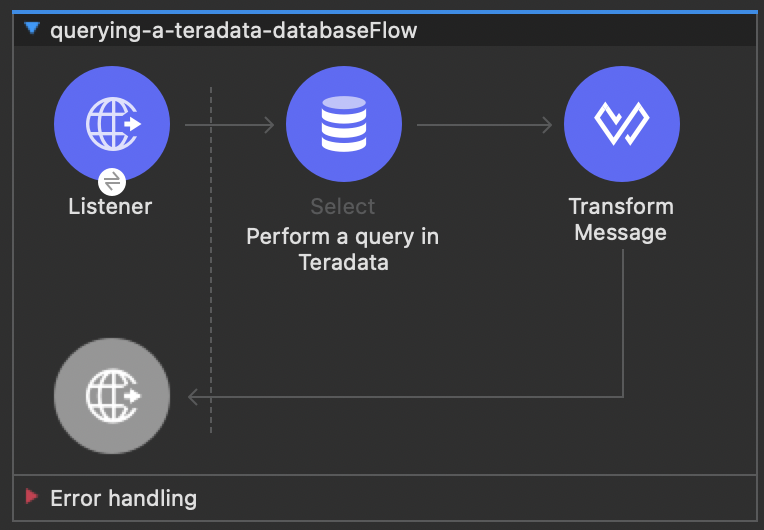
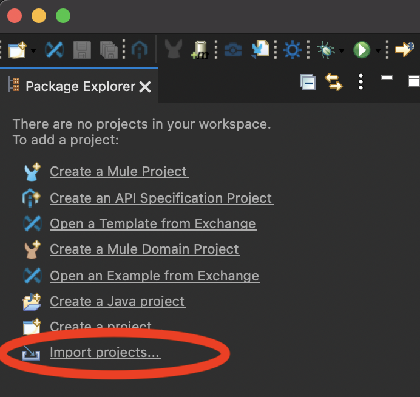
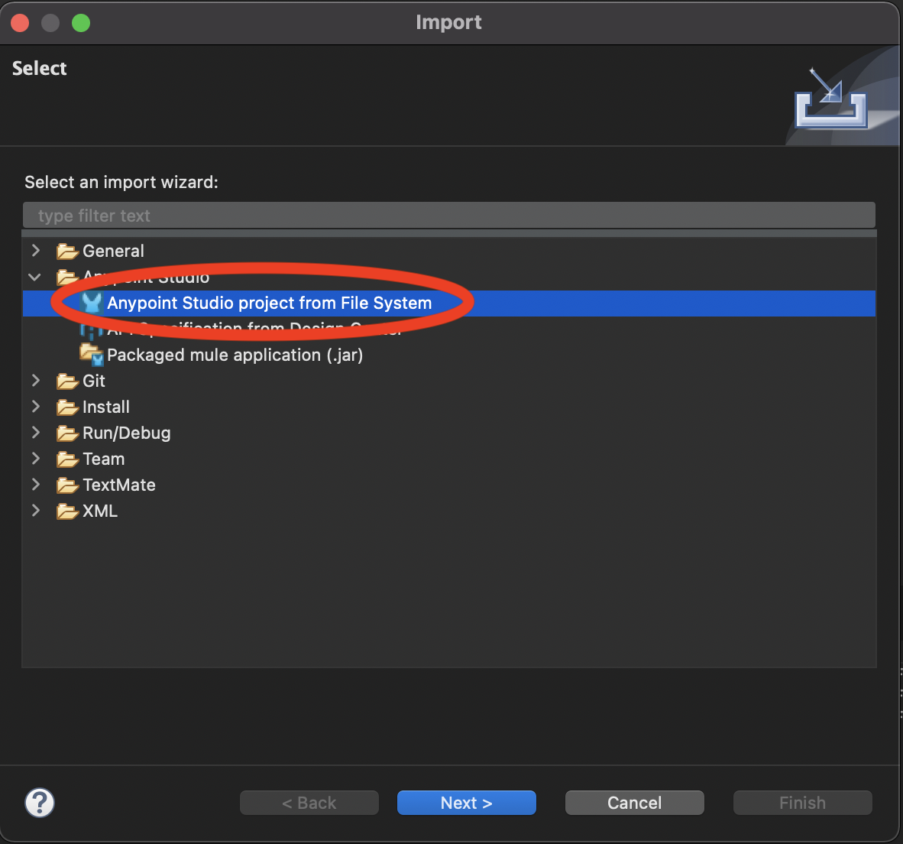

# Querying a Teradata Vantage database from a Mule service

This example is a clone of the Mulesoft MySQL sample project. It demonstrates how to query a Teradata database and expose results over REST API.

## Prerequsites

1. Mulesoft Anypoint Studio. You can download a 30-day trial from https://www.mulesoft.com/platform/studio.
2. Access to a Teradata Vantage instance. If you need a new instance of Vantage then the easiest way is to install Vantage Express on your local machine using [VMWare](https://quickstarts.teradata.com/docs/17.10/getting.started.vmware.html), [VirtualBox](https://quickstarts.teradata.com/docs/17.10/getting.started.vbox.html) or [UTM](https://quickstarts.teradata.com/docs/17.10/getting.started.utm.html).
3. Java JDK. See installation instructions for OpenJDK: https://openjdk.java.net/install/. 
3. Apache Maven. See installation instructions: https://maven.apache.org/install.html

## Example service

This example Mule service takes an HTTP request, queries the Teradata Vantage database and returns results in JSON format. 




The Mule HTTP connector listens for HTTP GET requests with the form: `http://<host>:8081/?lastname=<parameter>`. The HTTP connector passes the value of `<parameter>` as one of the message properties to a database connector. The database connector is configured to extract this value and use it in this SQL query:

```sql
select * from hr.employees where LastName = :lastName 
```

As you can see, we are using parameterized query with reference to the value of the parameter passed to the HTTP connector. So if the HTTP connector receives http://localhost:8081/?lastname=Smith, the SQL query will be:

```sql
select * from employees where last_name = Smith
```

The database connector instructs the database server to run the SQL query, retrieves the result of the query, and passes it to the Transform message processor which converts the result to JSON. Since the HTTP connector is configured as request-response, the result is returned to the originating HTTP client.

## Setup

1. Clone this repository:
	```bash
	git clone git@github.com:Teradata/mule-jdbc-example.git
	```
2. Edit `src/main/mule/querying-a-teradata-database.xml`, find the Teradata connection string `jdbc:teradata://localhost/user=dbc,password=dbc` and replace Teradata connection parameters to match your environment.
3. Create a sample database in your Vantage instance. Populate it with sample data.
    ```sql
    -- create database
    CREATE DATABASE HR
      AS PERMANENT = 60e6, SPOOL = 120e6;

    -- create table
    CREATE SET TABLE HR.Employees (
      GlobalID INTEGER,
      FirstName VARCHAR(30),
      LastName VARCHAR(30),
      DateOfBirth DATE FORMAT 'YYYY-MM-DD',
      JoinedDate DATE FORMAT 'YYYY-MM-DD',
      DepartmentCode BYTEINT
    )
    UNIQUE PRIMARY INDEX ( GlobalID );

    -- insert a record
    INSERT INTO HR.Employees (
      GlobalID,
      FirstName,
      LastName,
      DateOfBirth,
      JoinedDate,
      DepartmentCode
    ) VALUES (
      101,
      'Test',
      'Testowsky',
      '1980-01-05',
      '2004-08-01',
      01
    );
	```   

4. Import the JDBC driver to your local Maven repository:
    ```bash
    mvn install:install-file \
    -Dfile=dependencies/terajdbc4.jar \
    -DgroupId=com.teradata \
    -DartifactId=terajdbc4 \
    -Dversion=17.10.00.24 \
    -Dpackaging=jar \
    -DgeneratePom=true
    ```
5. Open the project in Anypoint Studio. 
    * Once in Anypoint Studio, click on `Import projects..`:
      
    * Select `Anypoint Studio project from File System
       
    * Use the directory where you cloned the git repository as the `Project Root`. Leave all other settings at their default values.

## Run

1. Run the example application in Anypoint Studio using the `Run` menu. The project will now build and run. It will take about one minute.
2. Got to your web browser and type in the following request:
    ```bash          
    http://localhost:8081/?lastname=Testowsky
    ```

    You should get the following JSON response:
      ```json
      [
        {
          "JoinedDate": "2004-08-01T00:00:00",
          "DateOfBirth": "1980-01-05T00:00:00",
          "FirstName": "Test",
          "GlobalID": 101,
          "DepartmentCode": 1,
          "LastName": "Testowky"
        }
      ]
      ```   
## Further reading

* View this [document](http://www.mulesoft.org/documentation/display/current/Database+Connector) for more information on how to configure a database connector on your machine.
* Access plain [Reference material](http://www.mulesoft.org/documentation/display/current/Database+Connector+Reference) for the Database Connector.
* Learn more about [DataSense](http://www.mulesoft.org/documentation/display/current/DataSense).
